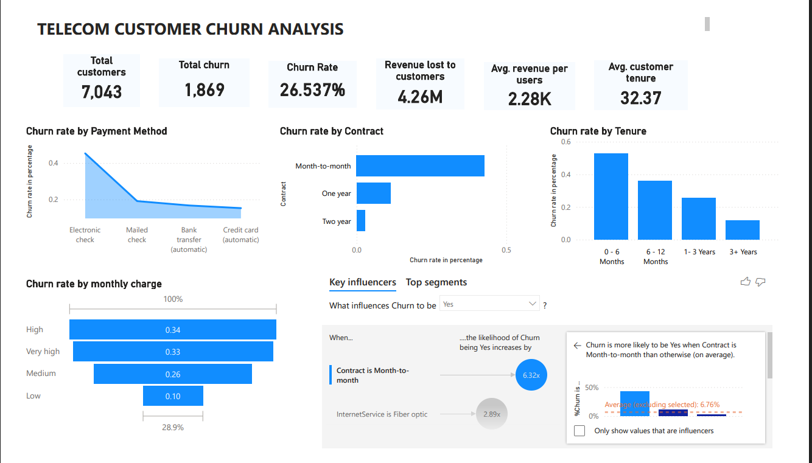

# Telecom_customer_churn_analysis
End-to-end telecom churn analysis using Power BI to identify drivers of customer churn and provide business insights and  recommendation.

# Telecom Customer Churn Analysis

## Project Overview
This project analyzes telecom customer churn to identify key factors that drive customer's churn & providing business insight and recommendation to reduce the churn rate.

Using Power BI, this analysis explores patterns in customer behavior, contract type, tenure, and monthly charges to determine the strongest predictors of churn.

## Business Problem
Customer churn is a major challenge for telecom companies. Losing customers reduces recurring revenue and increases acquisition costs.

The goal of this analysis is to identify:
- Key drivers of churn
- High-risk customer segments
- Opportunities to improve retention

## Tools & Technologies
- Power BI (Dashboard Development & Data Visualization)
- Excel (Data Cleaning & Dataset Exploration)

## Analytical Techniques
- Exploratory Data Analysis (EDA)
- Correlation Analysis
- Customer Churn Segmentation
- Business Intelligence Reporting

## Dataset
The dataset contains telecom customer information including:

- Customer tenure
- Monthly charges
- Contract type
- Payment method
- Internet service
- Churn status

## Key Insights

### 1. Contract Type
Customers with month-to-month contracts show the highest churn rate.

### 2. Tenure
Customers with shorter tenure  shows a high churn rate.

### 3. Monthly Charges
Higher monthly charges are correlated with increased churn.

### 4. Payment Method
Customers using electronic check method  of payment shows a higher churn rate.

## Dashboard

## Key Metrics
- Total Customers
- Churn Rate
- Revenue lost to customer
- Customer Segmentation

## Business Recommendation

1. Encourage customers to switch to long-term contracts by introducing incentives such as discounted rates or bonus services. This can reduce churn associated with month-to-month contracts.

2. Improve the onboarding experience during the first 6 months, as customers in the early stage of their subscription are more likely to churn. Providing proactive customer support and engagement during this period can improve retention.

3. Offer loyalty discounts or special packages to customers with high monthly charges, as they may be more price-sensitive and at higher risk of leaving

## Author
Samuel Shobowale  
Power BI Developer | Data Analyst | Business Intelligence
